 

&nbsp;

---

## 👨‍💻 About Me

Sou estudante de **Engenharia da Computação** e formado como **Técnico em Desenvolvimento de Sistemas**.

Tenho interesse em desenvolvimento de software, backend, bancos de dados, APIs, IoT e sistemas embarcados.

> **MAKE FUTURE TOGETHER 🚀**

---

## 🛠️ Skills & Technologies

### Linguagens

&nbsp;&nbsp;

&nbsp;&nbsp;

&nbsp;&nbsp;

&nbsp;&nbsp;

  

### Backend & APIs

&nbsp;&nbsp;

&nbsp;&nbsp;

  

### Banco de Dados

  

### IoT & Sistemas Embarcados

&nbsp;&nbsp;

  

### Ferramentas

&nbsp;&nbsp;

&nbsp;&nbsp;

&nbsp;&nbsp;

---

## 🚀 Featured Projects

### 🩺 Sensor de Quedas para Idosos
Projeto utilizando **ESP32, sensores, GPS e aplicativo**, voltado ao monitoramento e identificação de possíveis quedas.

### 🏆 Sistema de Interclasse Escolar
Sistema desenvolvido com **PHP e SQL**, incluindo gerenciamento de informações e banco de dados.

### 💙 Plataforma de Doações
Plataforma desenvolvida em **Java**, com utilização de **APIs** e integração com **Mercado Pago**.

---

## 🎓 Education

🎓 **Engenharia da Computação — UNISAL**

💻 **Técnico em Desenvolvimento de Sistemas**

---

### Let's build the future together. 🚀

